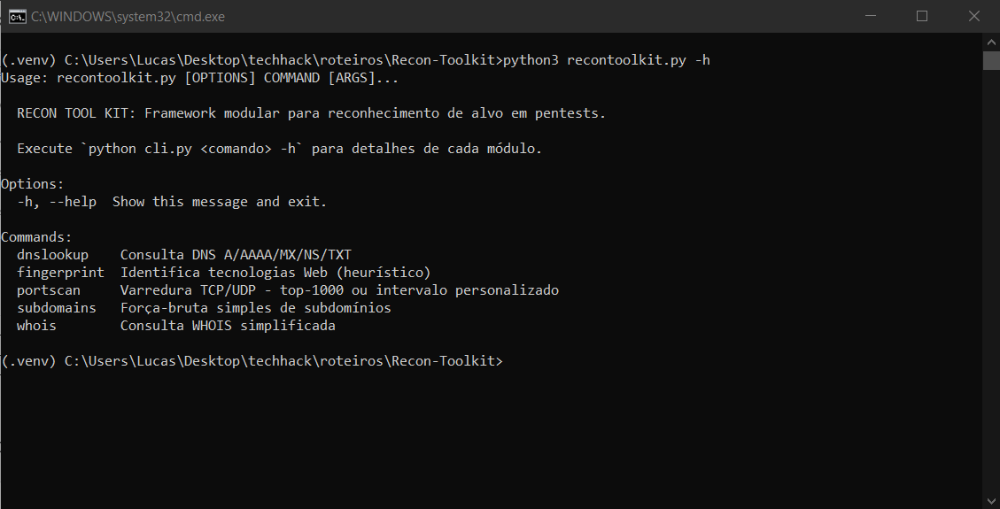

# Relatório Técnico: Reconhecimento em Testes de Intrusão (Pentest)

**Autor**: Lucas Lima

## Questões de Pesquisa

### 1. Além do PortScan, quais são as 5 ferramentas mais úteis para reconhecimento em um pentest?

1. **Shodan**: É como um buscador da internet, mas focado em dispositivos conectados. Com ele, dá pra encontrar câmeras, roteadores, servidores e até bancos de dados que estão abertos na internet, ótimo pra descobrir o que está exposto sem precisar escanear tudo manualmente.

2. **theHarvester**: Serve pra coletar e-mails e outros dados públicos de um domínio, como perfis em redes sociais. Isso ajuda bastante em testes que envolvem engenharia social, como phishing.

3. **Nikto**: Ferramenta que escaneia servidores web procurando por falhas comuns, como diretórios abertos, arquivos sensíveis ou configurações inseguras. É bem simples de usar e já ajuda a achar bastante coisa.

4. **Dirsearch**: Faz brute-force de diretórios em sites. Com ele dá pra descobrir páginas escondidas ou esquecidas, como /admin, /backup, etc. Isso pode revelar áreas sensíveis da aplicação.

5. **Wappalyzer**: Diz quais tecnologias um site está usando, tipo WordPress, React, Apache, etc. Isso ajuda a identificar possíveis vulnerabilidades específicas daquela tecnologia.


### 2. Qual a diferença entre um scanner de portas SYN e um TCP Connect Scan?

#### SYN Scan (Stealth Scan)
Os dois tipos de scan tentam descobrir quais portas estão abertas em um sistema, mas fazem isso de jeitos diferentes.

O SYN Scan é mais discreto. Ele envia só o pacote inicial da conexão (o SYN) e, se a porta responder com um SYN/ACK, já dá pra saber que ela está aberta. A conexão nem chega a ser completada. Isso faz com que o scan seja mais rápido e gere menos logs, então é ótimo pra quando você não quer ser detectado.

Já o TCP Connect Scan faz a conexão completa (SYN, SYN/ACK e ACK). Ele é mais fácil de usar, porque qualquer usuário pode fazer sem precisar de permissões especiais, mas como ele completa a conexão, acaba gerando mais logs e aumentando as chances de ser notado.

Em resumo: o SYN Scan é mais "furtivo", mas precisa de privilégios; o TCP Connect é mais simples, mas mais barulhento.

### 3. Como um pentester pode evitar ser detectado por sistemas de prevenção de intrusão (IPS) durante o reconhecimento?

Durante um reconhecimento, um pentester pode evitar ser detectado por sistemas de prevenção de intrusão (IPS) usando algumas táticas para "disfarçar" suas ações. Uma das mais comuns é fazer os scans de forma bem lenta, para não levantar suspeita com muitos acessos de uma vez. Também dá pra fragmentar os pacotes enviados, o que dificulta a leitura pelo IPS. Outra ideia é usar vários IPs (decoys) ou até mascarar o IP real com VPN ou proxies, o que atrapalha o sistema a descobrir de onde o scan veio. Também dá pra mudar o jeito que os pacotes são montados, fugindo do padrão das ferramentas mais conhecidas. No fim, a ideia é agir de forma discreta, sem chamar atenção, mesmo que isso torne o processo um pouco mais demorado.

## Descrição da Arquitetura e Decisões de Design

O projeto desenvolvido foi o **Recon Toolkit**, uma aplicação modular construída em Python para facilitar a fase inicial de reconhecimento em testes de intrusão.

### Arquitetura do Projeto

O Recon Toolkit foi estruturado em uma arquitetura modular para fácil expansão, organizada em:

```bash
recon_toolkit/
├── recon/
│ ├── portscan.py # Scanner TCP/UDP de portas
│ ├── dns_lookup.py # Consulta DNS A/AAAA/MX/NS/TXT
│ ├── whois_lookup.py # Consulta WHOIS simplificada
│ ├── subdomain_scanner.py # Brute-force de subdomínios
│ └── tech_fingerprint.py # Fingerprint de tecnologias Web
├── cli.py # Interface de Linha de Comando (CLI)
├── requirements.txt # Dependências Python
└── README.md # Documentação técnica e manual do usuário
```


### Decisões de Design

Durante o desenvolvimento da ferramenta, algumas decisões de design foram feitas para deixar o projeto mais organizado, fácil de manter e também mais fácil de usar. A principal delas foi o uso da biblioteca Click para criar a interface de linha de comando (CLI). O Click é bem simples de aprender e já vem com ajuda automática (--help, -h), suporte a argumentos, mensagens de erro amigáveis e outras funções úteis que agilizam muito o processo de desenvolvimento.

Também optei por criar todos os módulos seguindo um padrão de função chamada scan(), que recebe os parâmetros principais e retorna os resultados. Isso facilita bastante se for necessário adicionar novas ferramentas no futuro, é só seguir esse mesmo padrão, sem precisar mexer nos outros arquivos do projeto.

Outra coisa que pensei foi sobre a estabilidade da ferramenta. Por exemplo, no módulo de DNS, coloquei um sistema de fallback que tenta usar servidores DNS diferentes caso o primeiro falhe. Isso evita que o usuário fique sem resposta só porque um servidor estava fora do ar ou lento.

Por fim, escolhi bibliotecas conhecidas, como dnspython e python-whois, porque elas são confiáveis, estão bem documentadas e são mantidas por outras pessoas experientes. Isso dá mais segurança de que o código não vai quebrar do nada e que pode-se confiar nas respostas que essas bibliotecas retornam.

## Resultados

**Alvo**: rodolfoavelino.com.br



### 1. DNS Lookup


### 2. Fingerprint


### 3. Portscan


### 4. Subdomains


### 5. WHOIS

